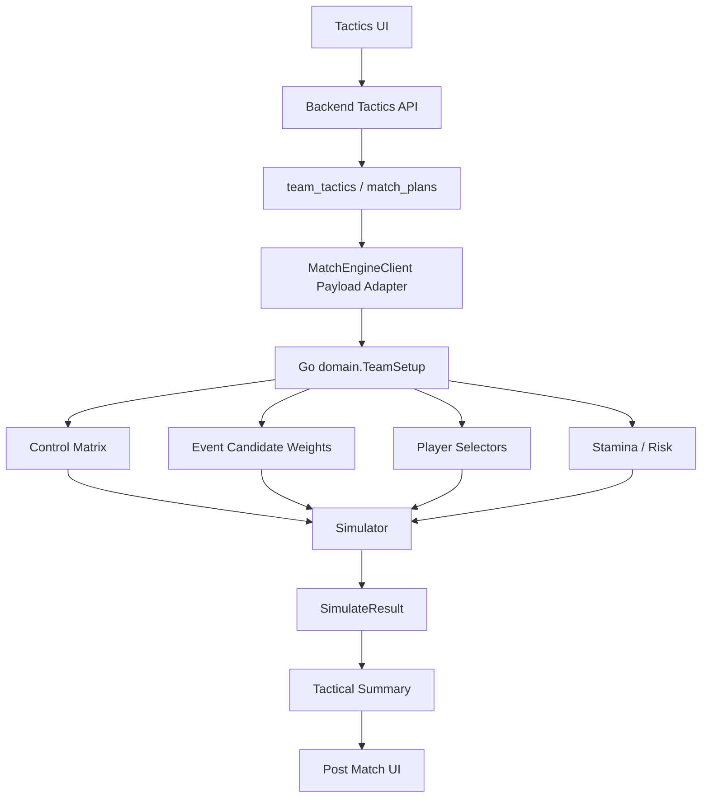

# 战术系统扩展技术设计

> 目标：把战术系统从“前端可调参数 + 后端自动预设”升级为一条完整、可验证、可平衡的比赛引擎输入链路。本文档侧重开发设计，不作为 PRD。

## 1. 当前状态

### 1.1 已有能力

Go 比赛引擎已有较好的扩展基础：

- 8 套阵型：`F01` 至 `F08`。
- 12 个团队战术参数：
  - `passing_style`
  - `attack_width`
  - `attack_tempo`
  - `defensive_line_height`
  - `crossing_strategy`
  - `shooting_mentality`
  - `playmaker_focus`
  - `pressing_intensity`
  - `defensive_compactness`
  - `marking_strategy`
  - `offside_trap`
  - `tackling_aggression`
- 3x3 区域控制矩阵：
  - 阵型、球员、战术、动态势头共同影响区域控制。
  - 区域控制再影响事件候选权重。
- 事件系统已包含多数可复用战术事件：
  - 传球：`short_pass`, `mid_pass`, `back_pass`, `long_pass`, `through_ball`, `lob_pass`, `pass_over_top`
  - 边路：`wing_break`, `cut_inside`, `cross`, `overlap`, `switch_play`
  - 中路：`triangle_pass`, `one_two`, `pivot_pass`, `build_up`
  - 防守：`tackle`, `intercept`, `clearance`, `block_pass`, `double_team`, `press_together`
  - 门将：`goal_kick`, `keeper_short_pass`, `keeper_throw`
  - 转换：`counter_attack`, `turnover`

### 1.2 主要问题

当前战术系统的短板不是“字段太少”，而是链路不完整：

1. 前端战术页把阵型、首发和战术保存到 `localStorage`。
2. 后端正式构造比赛 payload 时仍通过自动逻辑选择阵型、首发和战术预设。
3. Go 引擎能接收 `TacticalSetup`，但不能接收玩家级别的个人指令、情境规则和路线偏好。
4. 赛后能看到统计，但缺少“本场战术实际触发了什么”的诊断反馈。

因此第一优先级是打通生效链路，再扩展维度。

## 2. 设计原则

### 2.1 不重写比赛引擎主循环

保留现有框架：

```go
for match not finished {
    compute control matrix
    apply stamina decay
    build candidate event pool
    adjust event weights
    pick event
    execute event
    update state
}
```

扩展点应集中在：

- payload 数据结构
- 战术配置持久化
- 候选事件权重调整
- 目标球员选择器
- 区域控制修正
- 体能和风险修正
- 赛后战术摘要

### 2.2 战术必须可解释

每个新设置都应至少影响以下一种可观察结果：

- 区域控制变化
- 事件频率变化
- 事件成功率变化
- 球员选择变化
- 体能消耗变化
- 犯规、失误、越位等风险变化
- 赛后战术摘要变化

如果一个战术字段只存在于 UI，但不能在统计或事件叙事中观察到，就不应上线。

### 2.3 先团队，后个人，再情境

建议迭代顺序：

1. 团队战术生效链路。
2. 阶段化团队战术。
3. 个人指令。
4. 情境战术规则。
5. 战术诊断和自动平衡测试。

## 3. 目标架构



## 4. 数据模型设计

### 4.1 后端持久化表

新增 `team_tactics`，保存球队默认战术方案。

建议字段：

```sql
CREATE TABLE team_tactics (
    id VARCHAR(36) PRIMARY KEY,
    team_id VARCHAR(36) NOT NULL UNIQUE,
    formation_id VARCHAR(8) NOT NULL DEFAULT 'F01',
    preset_id VARCHAR(64),
    team_instructions JSON NOT NULL,
    player_instructions JSON NOT NULL,
    set_piece_instructions JSON NOT NULL,
    substitution_rules JSON NOT NULL,
    created_at DATETIME NOT NULL,
    updated_at DATETIME NOT NULL
);
```

后续如果需要赛前临时方案，再加 `match_plans`：

```sql
CREATE TABLE match_plans (
    id VARCHAR(36) PRIMARY KEY,
    fixture_id VARCHAR(36) NOT NULL,
    team_id VARCHAR(36) NOT NULL,
    formation_id VARCHAR(8) NOT NULL,
    lineup_player_ids JSON NOT NULL,
    bench_player_ids JSON NOT NULL,
    team_instructions JSON NOT NULL,
    player_instructions JSON NOT NULL,
    set_piece_instructions JSON NOT NULL,
    substitution_rules JSON NOT NULL,
    locked_at DATETIME,
    created_at DATETIME NOT NULL,
    updated_at DATETIME NOT NULL
);
```

第一阶段可以只做 `team_tactics`，正式比赛用球队默认方案。

### 4.2 后端 schema

建议保留现有 12 个字段作为 `legacy_team_sliders`，同时引入阶段化字段。

```python
class TeamInstructions(BaseModel):
    legacy_team_sliders: dict[str, int]
    in_possession: InPossessionInstructions
    transition: TransitionInstructions
    out_of_possession: OutOfPossessionInstructions
    goalkeeper_distribution: GoalkeeperDistributionInstructions
    player_instructions: list[PlayerInstruction] = []
```

> 实现说明：`player_instructions` 已内嵌在 `team_instructions` JSON 中，不再单独建表字段，简化迁移与回滚。

字段设计：

```python
class InPossessionInstructions(BaseModel):
    build_up_style: Literal["short", "balanced", "direct", "long_ball"]
    chance_creation: Literal["patient", "balanced", "early_shot", "work_into_box"]
    attack_route: Literal["left", "center", "right", "both_wings", "mixed"]
    width: int  # 0-4
    tempo: int  # 0-4
    passing_risk: int  # 0-4
    crossing_frequency: int  # 0-4
    dribble_frequency: int  # 0-4
    shooting_frequency: int  # 0-4
```

```python
class TransitionInstructions(BaseModel):
    after_possession_lost: Literal["counter_press", "balanced", "regroup"]
    after_possession_won: Literal["counter", "balanced", "hold_shape"]
    counter_directness: int  # 0-4
    reset_under_pressure: int  # 0-4
```

```python
class OutOfPossessionInstructions(BaseModel):
    defensive_line_height: int  # 0-4
    pressing_intensity: int  # 0-4
    pressing_trigger: Literal["passive", "bad_touch", "wide_trap", "center_trap", "always"]
    compactness: int  # 0-4
    marking: Literal["zonal", "mixed", "man"]
    tackling_aggression: int  # 0-4
    offside_trap: int  # 0-2
```

```python
class GoalkeeperDistributionInstructions(BaseModel):
    distribution_target: Literal["center_backs", "fullbacks", "midfield", "target_forward", "mixed"]
    distribution_length: Literal["short", "balanced", "long"]
    release_speed: Literal["slow", "balanced", "quick"]
```

### 4.3 Go domain 扩展

现有 `TacticalSetup` 保留，新增可选扩展结构：

```go
type PlayerInstruction struct {
    PlayerID          string `json:"player_id"`
    CarryBall         int    `json:"carry_ball"`          // 0-4
    PassingRisk       int    `json:"passing_risk"`        // 0-4
    ShootingFrequency int    `json:"shooting_frequency"`  // 0-4
    CrossingFrequency int    `json:"crossing_frequency"`  // 0-4
    PressingIntensity int    `json:"pressing_intensity"`  // 0-4
    HoldPosition      int    `json:"hold_position"`       // 0-4
    ForwardRuns       int    `json:"forward_runs"`        // 0-4
}

type TeamInstructions struct {
    LegacyTeamSliders          TacticalSetup                       `json:"legacy_team_sliders"`
    InPossession               InPossessionInstructions            `json:"in_possession"`
    Transition                 TransitionInstructions              `json:"transition"`
    OutOfPossession            OutOfPossessionInstructions         `json:"out_of_possession"`
    GoalkeeperDistribution     GoalkeeperDistributionInstructions  `json:"goalkeeper_distribution"`
    PlayerInstructions         []PlayerInstruction                 `json:"player_instructions"`
}

type TeamSetup struct {
    TeamID           string            `json:"team_id"`
    Name             string            `json:"name"`
    FormationID      string            `json:"formation_id"`
    Players          []PlayerSetup     `json:"players"`
    Bench            []PlayerSetup     `json:"bench"`
    Tactics          TacticalSetup     `json:"tactics"`
    TeamInstructions *TeamInstructions `json:"team_instructions,omitempty"`
}
```

兼容策略：

- 没有 `TeamInstructions` 时，使用 `TacticalSetup` 推导默认阶段化指令。
- 有 `TeamInstructions` 时，阶段化指令优先，`TacticalSetup` 仍用于旧逻辑和回归测试。

## 5. 引擎映射设计

### 5.1 团队进攻路线

新增 `attack_route`，影响区域控制和事件权重。

映射：

| route | 区域控制 | 事件权重 |
|---|---|---|
| left | 左路列 `c=0` + control | `wing_break`, `overlap`, `cross`, `switch_play` |
| center | 中路列 `c=1` + control | `pivot_pass`, `triangle_pass`, `one_two`, `through_ball` |
| right | 右路列 `c=2` + control | 同 left |
| both_wings | 两翼 + control，中路小幅下降 | `switch_play`, `overlap`, `cross` |
| mixed | 不调整 | 使用现有权重 |

实现点：

- `tacticDelta` 增加 route 对 3x3 控制矩阵的修正。
- `processEvent` 根据 route 调整候选事件权重。

### 5.2 传球风险与推进方式

新增 `passing_risk` 和 `build_up_style`。

映射：

- `passing_risk` 低：
  - 提高 `short_pass`, `back_pass`, `pivot_pass`, `hold_ball`
  - 降低 `through_ball`, `pass_over_top`, `long_pass`
  - 降低失误和快速推进概率
- `passing_risk` 高：
  - 提高 `through_ball`, `pass_over_top`, `long_pass`, `lob_pass`
  - 提高失误、越位和反击被打风险

`build_up_style`：

| style | 事件倾向 |
|---|---|
| short | `keeper_short_pass`, `short_pass`, `build_up`, `pivot_pass` |
| balanced | 使用现有权重 |
| direct | `mid_pass`, `through_ball`, `pass_over_top` |
| long_ball | `goal_kick`, `long_pass`, `header` |

实现点：

- 将 `ComputeRiskIndex` 拆成更细的风险函数：
  - `ComputePassRisk`
  - `ComputeShotRisk`
  - `ComputeDefensiveRisk`
- 不建议继续把所有风险合并进一个 `RiskIndex`，否则会出现“快节奏导致所有行为都冒险”的副作用。

### 5.3 射门倾向

新增 `shooting_frequency` 或复用 `shooting_mentality`。

映射：

- 高射门：
  - 提高 `close_shot`, `long_shot`, `one_on_one`
  - 降低 `hold_ball`, `back_pass`
  - 降低平均射门质量
- 低射门：
  - 降低 `long_shot`
  - 提高 `short_pass`, `triangle_pass`, `one_two`, `hold_ball`
  - 提高前场被抢断风险，因为持球时间变长

实现点：

- `processEvent` 前场和中场射门候选权重。
- `doShotEvent` 可接收 `shotSelectionQuality` 修正。

### 5.4 传中与边路

现有 `crossing_strategy` 只粗略提高传中和头球权重。建议拆成：

- `crossing_frequency`
- `crossing_type`: `low`, `mixed`, `high`
- `attack_route`

第一阶段可以只加频率，不加类型。

映射：

- 高频传中：
  - 提高 `cross`, `overlap`, `wing_break`
  - 前场边路成功后更容易进入 `cross_chain`
  - 依赖 `CRO`, `HEA`, `STR`, `POS`
- 低频传中：
  - 提高 `cut_inside`, `one_two`, `through_ball`

### 5.5 转换阶段

新增：

- `after_possession_lost`
- `after_possession_won`

映射：

`counter_press`：

- 丢球后若区域在中前场，提高立即反抢概率。
- 提高 `press_together`, `double_team`, `tackle`, `intercept`。
- 增加体能消耗和被直塞风险。

`regroup`：

- 丢球后减少反抢事件。
- 提高后场、中路控制恢复。
- 降低前场夺回球权概率。

`counter`：

- 得球后提高 `counter_attack`, `pass_over_top`, `through_ball`。
- 若 `counter_directness` 高，推进更快但失误更高。

`hold_shape`：

- 得球后提高 `hold_ball`, `back_pass`, `pivot_pass`。
- 降低立即反击。

实现点：

- 现有 turnover 后已有 `applyCounterBoost` 和 high press 逻辑，可扩展为统一函数：

```go
func (sim *Simulator) applyTransitionInstructions(ms *domain.MatchState, possBefore domain.Side, zone [2]int) {
    newTeam := ms.Team(ms.Possession)
    lostTeam := ms.Team(possBefore)
    // after possession won
    // after possession lost
}
```

### 5.6 门将分配

这是最容易落地、玩家感知最强的一组设置。

字段：

- `distribution_target`
- `distribution_length`
- `release_speed`

映射：

| 设置 | 事件权重 |
|---|---|
| center_backs | `keeper_short_pass` +, target DF |
| fullbacks | `keeper_throw` +, target side DF/MF |
| midfield | `keeper_short_pass`/`mid_pass` +, target MF |
| target_forward | `goal_kick`/`long_pass` +, target FW |
| quick | 得球后 `counter_attack` 或快速推进 + |
| slow | `hold_ball`, `build_up` + |

实现点：

- `processEvent` 中 GK 持球候选权重。
- `doGoalKickEvent`, `doKeeperShortPassEvent`, `doKeeperThrowEvent` 中目标选择。
- `SelectPassTarget` 增加 instruction-aware variant。

## 6. 个人指令设计

### 6.1 第一阶段个人指令

每个球员先支持 7 个字段：

```json
{
  "player_id": "xxx",
  "carry_ball": 2,
  "passing_risk": 2,
  "shooting_frequency": 2,
  "crossing_frequency": 2,
  "pressing_intensity": 2,
  "hold_position": 2,
  "forward_runs": 2
}
```

默认值为 2。

### 6.2 事件映射

| 个人指令 | 主要影响 |
|---|---|
| carry_ball | `dribble_past`, `wing_break`, `cut_inside` 权重 |
| passing_risk | `through_ball`, `pass_over_top`, `long_pass` 权重和失误率 |
| shooting_frequency | `close_shot`, `long_shot` 权重 |
| crossing_frequency | `cross`, `overlap` 后传中倾向 |
| pressing_intensity | 无球时被选为逼抢/抢断球员概率；高强度会增加防守动作体能消耗 |
| hold_position | 前插和压上概率下降，防守区域控制提高 |
| forward_runs | 接直塞、反越位、前场触球权重 |

### 6.3 目标选择器扩展

当前选择器主要按位置和区域权重选择球员。需要增加个人指令权重：

```go
func instructionWeightForEvent(p *PlayerRuntime, eventType string, instr PlayerInstruction) float64 {
    switch eventType {
    case config.EventDribblePast, config.EventWingBreak, config.EventCutInside:
        return sliderWeight(instr.CarryBall)
    case config.EventThroughBall, config.EventPassOverTop, config.EventLongPass:
        return sliderWeight(instr.PassingRisk)
    case config.EventCloseShot, config.EventLongShot:
        return sliderWeight(instr.ShootingFrequency)
    case config.EventCross:
        return sliderWeight(instr.CrossingFrequency)
    }
    return 1.0
}
```

建议 `sliderWeight` 控制在 `0.75` 到 `1.35`，避免个人指令压过能力值。

## 7. 情境规则设计（已实现）

`TeamInstructions` 内嵌 `situational_rules` 列表，每条规则包含条件与覆盖：

```json
[
  {
    "id": "rule-behind-late",
    "name": "落后追分",
    "enabled": true,
    "condition": {"minute_gte": 40, "goal_diff_lte": -1},
    "override": {
      "tempo": 4,
      "shooting_frequency": 4,
      "defensive_line_height": 4,
      "pressing_intensity": 4
    }
  },
  {
    "id": "rule-ahead-late",
    "name": "领先稳守",
    "enabled": true,
    "condition": {"minute_gte": 40, "goal_diff_gte": 1},
    "override": {
      "tempo": 1,
      "defensive_line_height": 1,
      "after_possession_won": "hold_shape"
    }
  }
]
```

支持的条件字段：`minute_gte`、`minute_lt`、`goal_diff_lte`、`goal_diff_gte`、`team_stamina_avg_lte`。
支持的覆盖字段：节奏、宽度、传球冒险、传中/射门频率、防线高度、逼抢强度、转换指令、推进方式、创造机会方式。

实现点：

- 每次 `processEvent` 前调用 `ComputeEffectiveInstructions` 计算 `TeamRuntime.EffectiveInstructions`。
- `Instructions()` 优先返回 `EffectiveInstructions`，不直接修改 `TeamInstructions`。
- 触发的规则 ID 记录到 `TacticalSummary.situational_rule_triggers`，便于赛后解释。
- AI 顾问根据风格画像自动生成默认的落后/领先规则。

## 8. 赛后战术摘要

新增 `TacticalSummary` 到 `SimulateResult`。

```go
type TacticalSummary struct {
    TeamID string `json:"team_id"`

    RouteUsage map[string]int `json:"route_usage"`
    EventCounts map[string]int `json:"event_counts"`
    InstructionTriggers map[string]int `json:"instruction_triggers"`
    SituationalRuleTriggers map[string]int `json:"situational_rule_triggers"`

    PossessionByZone [3][3]int `json:"possession_by_zone"`
    TurnoversByZone [3][3]int `json:"turnovers_by_zone"`
    ShotsByZone [3][3]int `json:"shots_by_zone"`
    PressWinsByZone [3][3]int `json:"press_wins_by_zone"`

    CounterAttacks int `json:"counter_attacks"`
    HighPressRecoveries int `json:"high_press_recoveries"`
    GkShortDistributions int `json:"gk_short_distributions"`
    GkLongDistributions int `json:"gk_long_distributions"`
}
```

前端赛后页可先展示开发向摘要：

- 本场主要进攻路线。
- 传中、内切、直塞、反击次数。
- 高位逼抢夺回球权次数。
- 门将短传/长传分配次数。
- 哪些个人指令触发最多。

## 9. API 设计

### 9.1 获取当前战术

```http
GET /teams/{team_id}/tactics
```

返回：

```json
{
  "formation_id": "F01",
  "lineup_player_ids": [],
  "bench_player_ids": [],
  "team_instructions": {},
  "player_instructions": [],
  "set_piece_instructions": {},
  "substitution_rules": {}
}
```

### 9.2 保存当前战术

```http
PUT /teams/{team_id}/tactics
```

校验：

- 阵型必须在 `F01-F08`。
- 首发必须满足 8 人制阵型要求。
- player id 必须属于该球队。
- slider 范围必须合法。
- 未支持字段拒绝或忽略，建议开发期拒绝。

### 9.3 比赛 payload 构造优先级

```text
match_plan locked setup
> team_tactics saved setup
> backend automatic setup
> balanced fallback
```

## 10. 迭代计划

### V1：战术生效链路

范围：

- 新增 `team_tactics` 表。
- 新增后端 GET/PUT API。
- 前端保存改为调用 API，保留 localStorage 仅作草稿。
- `MatchEngineClient._build_team_setup` 优先使用保存的阵型、首发、战术。
- Go payload 保持现有 `TacticalSetup`，不加新字段。

验收：

- 修改 UI 战术后，正式比赛 payload 中 `formation_id` 和 `tactics` 与保存值一致。
- 赛后 `match_setup` 能看到玩家战术。
- 回归测试通过。

### V2：阶段化团队战术

范围：

- 新增 `TeamInstructions` 到后端 schema 和 Go domain。
- 增加进攻路线、传球风险、转换阶段、门将分配。
- 在 Go 引擎中把这些字段映射到事件权重。
- 新增基础 `TacticalSummary`。

验收：

- 边路路线显著提高边路事件占比。
- 中路路线显著提高 `pivot_pass`, `triangle_pass`, `through_ball` 占比。
- 门将短传/长传设置能稳定改变分配事件占比。
- 快速反击设置提高 `counter_attack` 占比，但不会形成绝对最优。

### V3：个人指令（已实现）

范围：

- 新增 `PlayerInstruction` 并内嵌在 `TeamInstructions` 中。
- 前端球员面板增加个人指令滑块。
- AI 顾问根据球员属性/位置生成默认个人指令。
- `MatchEngineClient` 将个人指令下发到 Go 引擎。
- Go `PlayerRuntime` 绑定个人指令；`processEvent` 候选权重、选择器与赛后 `InstructionTriggers` 均接入个人指令。

验收：

- `carry_ball=4` 的球员过人/边路推进事件增加。
- `shooting_frequency=4` 的前锋射门占比增加。
- `pressing_intensity=4` 的球员参与抢断/压迫事件增加，同时体能消耗增加。
- 赛后 `TacticalSummary.instruction_triggers` 可统计触发维度。

### V4：情境规则与平衡（已实现）

范围：

- 新增 `SituationalRule` 并内嵌在 `TeamInstructions` 中。
- Go 引擎每事件前计算 `EffectiveInstructions`，应用所有匹配规则。
- AI 顾问根据风格画像自动生成默认落后/领先规则。
- 前端提供通用情境规则编辑器：条件输入、覆盖项增删、启用开关、规则数量限制。
- 赛后摘要输出 `situational_rule_triggers`。

验收：

- 领先后保守策略能降低节奏和风险。
- 落后后强攻策略能提高射门和前场控制，但丢球风险增加。
- 任何单一战术配置不应长期超过基准胜率过多。

## 11. 测试设计

### 11.1 单字段影响测试

每个新字段都应有单独测试：

```text
base tactic vs modified tactic
same lineup
same formation
N matches per setting
compare event deltas and win-rate swing
```

重点不是只看胜率，而是先看战术信号：

- route 改变后，区域事件占比是否变化。
- goalkeeper_distribution 改变后，GK 分配事件是否变化。
- pressing 改变后，press wins 和体能消耗是否变化。
- player instruction 改变后，目标球员事件占比是否变化。

### 11.2 组合矩阵测试

扩展现有 `TestTacticsMatrix`：

- 12 套旧预设保留。
- 新增 8 套阶段化预设：
  - 中路渗透
  - 双翼传中
  - 低位长传
  - 高位反抢
  - 快速反击
  - 控球消耗
  - 全力强攻
  - 保护领先

输出：

- 胜率矩阵
- 平均进球
- 射门、传中、直塞、反击、抢断、体能消耗
- 战术信号强度

### 11.3 红线

- 新字段不能让平均总进球继续失控。
- 极端设置应有代价。
- 均衡战术不能长期成为明显陷阱选项。
- 个人指令不能压过球员能力。能力差的球员即使设置为多射门，也应表现为低效率和更多浪费。
- 战术效果必须能从事件统计或赛后摘要中验证。

## 12. 风险与约束

### 12.1 字段过多导致不可平衡

解决：

- UI 可以渐进展示，但引擎字段先稳定少量。
- 每个字段必须有测试。
- 每个字段权重先控制在小范围，避免压过能力值。

### 12.2 旧战术与新战术双轨复杂

解决：

- `TacticalSetup` 保留为兼容层。
- 新 `TeamInstructions` 可由旧字段推导。
- 一段时间内测试同时覆盖旧预设和新预设。

### 12.3 玩家觉得战术没有反馈

解决：

- V2 就必须输出 `TacticalSummary`。
- 赛后至少展示主要路线、关键事件频率、门将分配、反抢成功。

### 12.4 战术成为唯一最优解

解决：

- 每个极端战术都有明确成本：
  - 高压：体能、身后空间、犯规。
  - 控球：推进慢、射门少。
  - 长传：失误多、控球率低。
  - 强攻：后场控制下降。
  - 低位：前场控制和射门数下降。

## 13. 首批推荐实现字段

为了开发性和玩家感知，第一批不建议超过 8 个新语义字段：

1. `attack_route`
2. `passing_risk`
3. `dribble_frequency`
4. `after_possession_lost`
5. `after_possession_won`
6. `goalkeeper_distribution.target`
7. `goalkeeper_distribution.length`
8. `player_instructions.carry_ball / shooting_frequency / pressing_intensity`

其中门将分配和进攻路线最适合先做，因为它们能直接复用现有事件，并且赛后统计容易验证。

## 14. 开发顺序建议

推荐实际落地顺序：

1. 建 `team_tactics`，把前端保存从 localStorage 改成 API。
2. **赛季初始化时为 AI 球队生成默认战术方案**（基于现有 `AITrainingPlanner` 风格画像）。
3. 后端 payload 使用玩家保存阵型和战术；AI 球队读取 `team_tactics` 而非自动选择。
4. 给 Go 结果加最小 `TacticalSummary`，先统计现有事件。
5. 加 `goalkeeper_distribution`，完成第一组新字段从 UI 到引擎生效。
6. 加 `attack_route`，影响区域控制和事件权重。
7. 加 `passing_risk` 和 `after_possession_won/lost`。
8. 加个人指令；AI 给关键球员设置简单个人指令。
9. 实现 `AITacticsAdvisor` 赛前微调与情境规则引擎。
10. 扩展战术矩阵测试和平衡报告，覆盖 AI vs AI、AI vs 人类。

这条路线能先修正“战术是否真的生效”的根问题，再逐步增加深度；AI 默认战术在 V1 同步落地，避免全 AI 联赛链路断裂。

## 15. AI 战术适应与决策

### 15.1 目标

保证全 AI 联赛在没有玩家干预的情况下也能持续运转，并且不同 AI 球队具备可辨识的战术风格。AI 球队应：

- 拥有与人类玩家统一的战术数据入口（`team_tactics`）。
- 能根据自身阵容特点和风格画像选择默认战术。
- 能在赛前根据对手、体能、排名形势做简单微调。
- 能在赛中根据比分、时间、红黄牌等情境做有限调节。

### 15.2 可复用基础

项目已有 AI 运营体系：

- `AITeamManagementService`：负责 AI 球队 roster、合同、青训、自由市场决策。
- `AITrainingPlanner`：定义了 6 种 AI 风格画像（`attacking`、`defensive`、`physical`、`technical`、`balanced`、`youth_focus`），并通过 `TeamTrainingAIProfile` 表持久化。
- `season_service.py`：赛季节点会调用上述 AI 服务。

战术系统可以直接复用 `TeamTrainingAIProfile` 中的风格字段，作为 AI 默认战术的输入。

### 15.3 三层设计

```text
┌─────────────────────────────────────────┐
│  L1: AI 战术风格画像（赛季级）            │
│  根据训练风格 + 阵容特点生成默认战术       │
├─────────────────────────────────────────┤
│  L2: 赛前战术选择（比赛前）               │
│  根据对手、体能、排名、主客场做简单微调    │
├─────────────────────────────────────────┤
│  L3: 赛中简单调节（情境规则）              │
│  落后/领先/红牌/体能危机时自动覆盖         │
└─────────────────────────────────────────┘
```

#### L1：AI 战术风格画像

扩展 `TeamTrainingAIProfile`（或在 `team_tactics` 中新增 `ai_profile` JSON 字段），把训练风格映射为默认战术：

| 训练风格 | 默认阵型 | 默认战术预设 | 进攻路线 | 特点 |
|---|---|---|---|---|
| `attacking` | F05 / F03 | `all_out` / `high_press` | center | 强攻、高位 |
| `defensive` | F04 / F06 | `deep_defense` / `counter` | mixed | 低位、反击 |
| `physical` | F02 / F08 | `high_press` / `wide_attack` | both_wings | 高压、边路 |
| `technical` | F07 / F01 | `possession` | center | 控球、中路 |
| `balanced` | F01 | `balanced` | mixed | 均衡 |
| `youth_focus` | F01 / F07 | `balanced` / `possession` | mixed | 稳健、培养 |

生成默认战术时，结合阵容短板做修正：

- 后卫人数不足或平均防守属性低 → 降低 `defensive_line_height` 和 `pressing_intensity`。
- 前锋速度突出 → 提高 `attack_tempo`，选择 `counter` 预设。
- 体能储备不足 → 整体降低高压和节奏相关字段。

#### L2：赛前战术选择

新增 `AITacticsAdvisor` 服务，在 `MatchEngineClient._build_team_setup` 之前调用。输入包括：

- 本队 `team_tactics` 默认方案
- 本队球员属性、体能、停赛、伤病
- 对手近期数据（场均进球、失球、常用阵型）
- 比赛重要性（联赛/杯赛/保级/争冠）
- 主客场

输出为最终生效的 `formation_id`、`lineup_player_ids`、`team_instructions`。

简单规则示例：

```python
if opponent_avg_goals > 2.0 and my_defense_weak:
    instructions.out_of_possession.defensive_line_height = 0
    instructions.transition.after_possession_won = "counter"

if my_avg_fitness < 72:
    instructions.out_of_possession.pressing_intensity = min(1, current)
    instructions.in_possession.tempo = min(2, current)
```

赛前调整只做**微调**，避免 AI 频繁大变阵导致风格不稳定。

#### L3：赛中简单调节

复用第 7 节「情境规则」机制，AI 和人类玩家共用同一套引擎。AI 默认开启内置规则，人类玩家可选择开启。

示例规则：

```json
[
  {
    "condition": {"minute_gte": 40, "goal_diff_lte": -1, "is_ai": true},
    "override": {
      "tempo": 4,
      "shooting_frequency": 4,
      "defensive_line_height": 4,
      "pressing_intensity": 4,
      "attack_route": "center"
    }
  },
  {
    "condition": {"minute_gte": 40, "goal_diff_gte": 1, "is_ai": true},
    "override": {
      "tempo": 1,
      "defensive_line_height": 1,
      "after_possession_won": "hold_shape"
    }
  }
]
```

赛中覆盖是临时生效，不写入 `team_tactics`。触发记录进入 `TacticalSummary`，便于赛后解释。

### 15.4 服务层设计

新增 `backend/app/services/ai_tactics_advisor.py`：

```python
class AITacticsAdvisor:
    async def generate_default_tactics(self, team_id: str) -> dict:
        """赛季初/AI 球队创建时生成默认战术"""

    async def pick_match_tactics(
        self,
        team_id: str,
        fixture: Fixture,
    ) -> dict:
        """赛前根据对手和形势微调战术"""

    def apply_situation_overrides(
        self,
        instructions: TeamInstructions,
        state: MatchStateSnapshot,
    ) -> TeamInstructions:
        """赛中情境规则覆盖"""
```

### 15.5 调用时机

| 时机 | 调用服务 | 说明 |
|---|---|---|
| 赛季初始化 | `AITacticsAdvisor.generate_default_tactics` | 为所有 AI 球队生成 `team_tactics` |
| 每日/比赛日前 | `AITacticsAdvisor.pick_match_tactics` | 生成下场比赛生效方案 |
| `MatchEngineClient._build_team_setup` | 读取 AI 战术方案 | 替代自动选择逻辑 |
| 比赛引擎内 | 情境规则引擎 | AI 和人类共用 |

### 15.6 与人类玩家的关系

- **统一数据模型**：AI 球队也读写 `team_tactics`，与人类玩家走同一条链路。
- **接管友好**：人类玩家接管 AI 球队时，继承 AI 已保存的默认战术，避免接管后战术被清空。
- **决策透明**：赛后摘要展示 AI 的战术风格和触发规则，帮助人类玩家理解对手。
- **强度控制**：AI 赛前规则不宜过于精细，先保证「有风格」而非「必胜」，保留人类手动调整的优势。

### 15.7 风险与约束

| 风险 | 影响 | 缓解 |
|---|---|---|
| AI 战术全选同一最优解 | 高 | 通过风格画像强制差异化；定期跑战术矩阵测试验证 AI 间胜率分布。 |
| AI 频繁变阵导致不稳定 | 中 | L2 只做微调；L3 只在大比分/后 40 分钟触发。 |
| AI 与人类战术强度不对等 | 中 | AI 规则保持简单；人类保留手动优势。 |
| AI 风格与阵容不匹配 | 低 | 生成默认战术时结合阵容短板修正。 |
| 增加数据库/调度复杂度 | 低 | 复用现有 `TeamTrainingAIProfile` 和 `season_service` 调用点。 |
