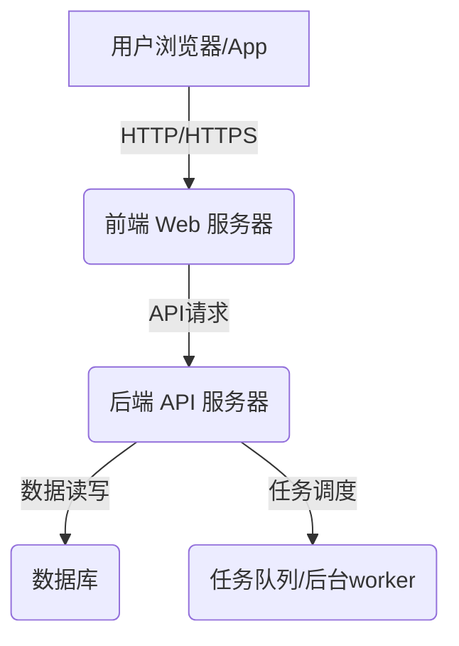

# 闪电超级联赛 - 技术架构文档

## 1. 引言

本文档旨在阐述"闪电超级联赛"在线足球经理游戏的技术架构方案。目标是选择一套既能满足当前PRD需求，又易于大学生开发者上手和维护，同时具备一定扩展性的技术栈。考虑到初期用户量预计不多，我们将优先考虑开发效率和成本效益。

## 2. 总体架构

我们将采用经典的前后端分离架构。

*   **前端 (Client)**：负责用户界面展示和用户交互，通过API与后端进行数据通信。
*   **后端 (Server)**：负责业务逻辑处理、数据存储、API接口提供以及比赛模拟等核心功能。
*   **数据库 (Database)**：持久化存储用户信息、球队数据、球员数据、比赛数据等。

## 3. 技术选型

### 3.1 前端技术栈

*   **框架**：**Vue.js (Vue 3)**
    *   **理由**：Vue.js 以其轻量、易学、高效和完善的生态系统而著称，非常适合快速构建交互式用户界面。Vue 3 带来了更好的性能和 Composition API，有助于代码组织。
    *   **UI组件库**：**Naive UI**
        *   **理由**：提供丰富、高质量的预构建组件，可以显著加快开发速度，保证UI的一致性和美观性。两者都是为Vue 3设计的优秀组件库。
    *   **状态管理**：**Pinia**
        *   **理由**：Vue官方推荐的新一代状态管理库，比Vuex更轻量、更易用，类型支持更好。
    *   **路由管理**：**Vue Router**
        *   **理由**：Vue官方路由管理器，与Vue.js深度集成，功能强大且稳定。
    *   **HTTP客户端**：**Axios**
        *   **理由**：广泛使用的基于Promise的HTTP客户端，易于封装和使用，支持请求/响应拦截等功能。
    *   **构建工具**：**Vite**
        *   **理由**：新一代前端构建工具，提供极速的冷启动和模块热更新，开发体验优秀。

### 3.2 后端技术栈

*   **框架**：**Python FastAPI**
    *   **理由**：FastAPI 是一个现代、快速（高性能）的Web框架，用于构建API。它基于Python 3.7+的类型提示，具有自动数据校验、序列化和API文档生成（基于OpenAPI和JSON Schema）等特性，开发效率高，学习曲线平缓。
    *   **ASGI服务器**：**Uvicorn**
        *   **理由**：FastAPI 官方推荐的ASGI服务器，性能出色。
    *   **ORM (对象关系映射)**：**SQLAlchemy** (配合 Alembic 进行数据库迁移)
        *   **理由**：SQLAlchemy 是Python中最强大的ORM之一，支持多种数据库，功能全面。Alembic 则可以很好地管理数据库结构变更。
    *   **任务队列** (用于比赛模拟、新闻生成等后台任务)：FastAPI 的 `BackgroundTasks` 来处理一些轻量级后台任务，或者使用更简单的库如 `APScheduler` 进行定时任务。
### 3.3 数据库

*   **关系型数据库**：**MySQL**
*   **缓存/消息队列Broker** ：**Redis**
    *   **理由**：高性能的内存数据结构存储，可用作数据库缓存、消息代理和会话管理等。

### 3.4 版本控制

*   **Git**：配合 **GitHub/** 等代码托管平台。
    *   **理由**：分布式版本控制系统的标准，便于团队协作和代码管理。

### 3.5 部署方案 (初步)

*   **前端部署**：
    *   **静态文件托管**：可以使用 **Nginx** 作为Web服务器托管Vue.js构建后的静态文件。也可以考虑使用 **Vercel**、**Netlify** 或 **GitHub Pages** 等平台进行部署，对小型项目非常友好。
*   **后端部署**：
    *   **容器化**：使用 **Docker** 将FastAPI应用及其依赖打包成容器镜像。
    *   **服务器**：初期可以考虑使用云服务提供商的入门级**虚拟机 (VPS)** (如阿里云、腾讯云、AWS EC2等)，或者 **PaaS平台** (如 Heroku, Google App Engine, Render 等) 简化部署流程。
    *   **进程管理**：使用 **Gunicorn** (配合 Uvicorn workers) 或直接使用 Uvicorn 管理FastAPI应用进程。
*   **数据库部署**：
    *   可以使用云服务提供商的**托管数据库服务** (RDS)，如 AWS RDS, Google Cloud SQL, 阿里云RDS等，免去自行维护的麻烦。
    *   或者在VPS上自行安装和配置数据库。

## 4. 核心功能实现思路 (简述)

### 4.1 比赛模拟引擎

*   **技术**：Python后端实现。
*   **思路**：
    1.  **数据输入**：双方球队的球员能力、状态、战术设置、阵型。
    2.  **事件驱动**：将比赛时间切分为若干个小片段或回合。每个回合根据球员能力、战术、随机数等计算可能发生的事件（如传球、射门、抢断、犯规等）。
    3.  **概率模型**：为不同事件的发生建立概率模型。例如，球员A射门的进球概率受其射门能力、对方门将能力、射门位置等多种因素影响。
    4.  **状态更新**：每个事件发生后，更新球员体力、士气、比赛比分等状态。
    5.  **文字直播生成**：根据发生的关键事件生成描述性文本。
    6.  **后台执行**：由于比赛模拟可能耗时，应作为后台任务执行 (Celery 或 FastAPI BackgroundTasks)，避免阻塞用户请求。比赛开始时触发任务，逐步将结果或事件推送给前端或存入数据库供前端拉取。

### 4.2 交易系统

*   **技术**：FastAPI后端处理交易逻辑，数据库记录交易状态。
*   **思路**：
    1.  **挂牌**：球员所有者设置挂牌价，球员状态变更为"挂牌中"。
    2.  **报价/竞价**：其他玩家对挂牌球员出价，系统记录所有报价。允许多人竞价，价高者得的机制。
    3.  **成交**：达到截止时间或一口价成交，系统处理球员归属变更、资金转移。
    4.  **事务保证**：数据库操作需要保证事务性，确保数据一致性（例如，扣款和球员交割要么都成功，要么都失败）。

### 4.3 新闻生成系统

*   **技术**：Python后端实现，可结合模板引擎。
*   **思路**：
    1.  **事件触发**：当特定事件发生时（如比赛结束、球员转会完成、重要伤病），触发新闻生成逻辑。
    2.  **模板化**：预设多种新闻模板，如"{球队A} {比分A}-{比分B} 战胜 {球队B}"，"{球员X} 以 {转会费} 转会至 {球队Y}"。
    3.  **数据填充**：从事件中提取关键信息填充到模板中。
    4.  **存储与展示**：生成的新闻存入数据库，供前端新闻中心页面展示。
    5.  **后台任务**：可作为后台任务异步生成。

### 4.4 青训系统

*   **技术**：Python后端逻辑，数据库存储青训球员信息。
*   **思路**：
    1.  **球探派遣**：玩家选择地区派遣球探，消耗游戏内资源。后台任务根据球探能力和地区潜力生成虚拟年轻球员列表（潜力、当前能力等）。
    2.  **球员培养**：玩家选择年轻球员加入青训营，定期（如每日/每周）根据设定的训练计划和青训设施等级，小幅提升球员能力。这可以通过定时任务完成。
    3.  **提拔**：玩家手动将达到条件的青训球员提拔至一线队。

## 5. 数据模型 (初步设想 - 重点表)

*   **Users**: `id`, `username`, `password_hash`, `email`, `created_at`, `last_login`, `is_vip`, `vip_level`
*   **Teams**: `id`, `user_id` (manager), `name`, `logo_url`, `stadium_name`, `fan_base_size`, `reputation`, `league_id`
*   **Players**: `id`, `name`, `age`, `nationality`, `position`, `height`, `weight`, `preferred_foot`, `current_team_id`, `contract_until`, `salary`, `market_value`, `status` (healthy, injured, suspended), `attributes` (JSON/HStore for shooting, passing, defending, etc.)
*   **PlayerAttributes**: `player_id`, `attribute_name`, `attribute_value` (如果不用JSON存储)
*   **Matches**: `id`, `home_team_id`, `away_team_id`, `match_datetime`, `league_id`, `season_id`, `home_score`, `away_score`, `status` (scheduled, in_progress, finished), `simulation_log` (JSON for text commentary)
*   **MatchEvents**: `id`, `match_id`, `event_type` (goal, card, substitution), `player_id`, `team_id`, `minute`, `description`
*   **Tactics**: `id`, `team_id`, `formation` (e.g., "4-4-2"), `mentality` (attacking, defensive), `instructions` (JSON)
*   **TrainingPlans**: `id`, `team_id`, `focus_area` (offense, defense, fitness), `intensity`
*   **Transfers**: `id`, `player_id`, `selling_team_id`, `buying_team_id`, `transfer_fee`, `status` (pending, completed, failed), `listed_price`, `bid_history` (JSON)
*   **NewsItems**: `id`, `title`, `content`, `created_at`, `category` (match, transfer, injury)
*   **YouthPlayers**: `id`, `name`, `age`, `nationality`, `position`, `potential_rating`, `current_ability_rating`, `scouted_by_team_id`, `status` (in_academy, released)

## 6. 非功能性需求

*   **安全性**：
    *   用户密码需加盐哈希存储。
    *   API接口应进行身份验证和授权 (如使用JWT)。
    *   防止常见的Web攻击 (XSS, CSRF, SQL注入等)，FastAPI本身有很多内置保护。
*   **性能**：
    *   API响应时间应尽可能快，尤其是常用接口。
    *   数据库查询优化，合理使用索引。
    *   比赛模拟等耗时操作异步化。
*   **可维护性**：
    *   代码结构清晰，遵循PEP 8 (Python) 和社区最佳实践 (Vue)。
    *   适当的注释和文档。
    *   模块化设计。
*   **可扩展性**：
    *   虽然初期用户量不大，但架构设计应考虑未来用户增长和功能增加的可能性。例如，后端服务可以设计为可水平扩展的（通过增加更多服务器实例）。

## 7. 风险与缓解

*   **开发资源有限**：作为大学生项目，时间和精力可能有限。选择熟悉且高效的技术栈，优先实现核心功能。
*   **比赛模拟引擎复杂度**：实现一个平衡且有趣的比赛引擎有挑战。初期可以从简化模型开始，逐步迭代优化。
*   **数据一致性**：尤其是在交易系统中，要保证数据操作的原子性和一致性。充分利用数据库事务。
*   **实时性要求**：如果未来需要更强的实时交互（如实时PVP），当前架构可能需要引入WebSocket等技术，后端也可能需要更复杂的实时处理能力。初期以文字推送和轮询/后台任务为主。

## 8. 总结

本技术架构方案选择以 Vue.js + Python FastAPI 为核心，搭配 PostgreSQL/MySQL 和 Redis，旨在提供一个易于开发、维护且能满足"闪电超级联赛"初期需求的解决方案。后续可根据实际运营情况和需求变化进行调整和扩展。 